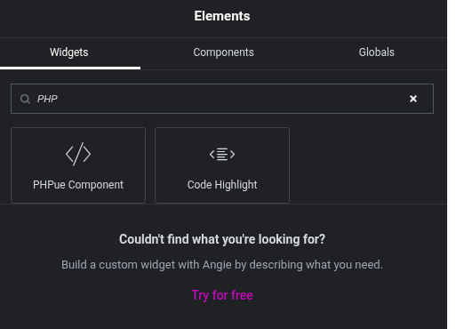
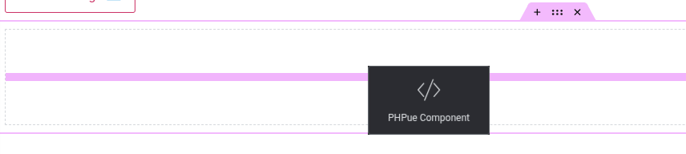
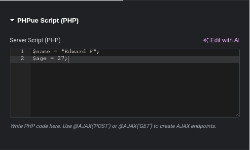
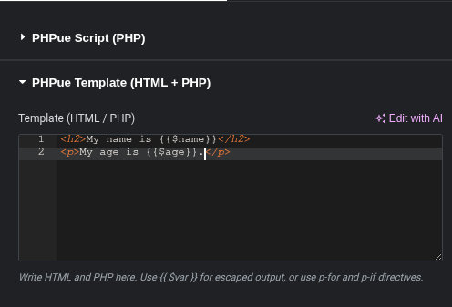
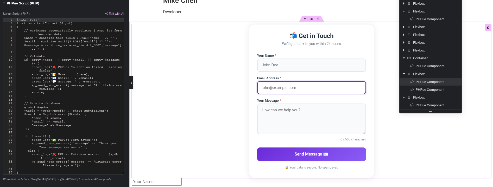

# 🚀 PHPue Elementor Widget

> Write PHP, HTML, and JavaScript in a single Elementor widget – just like PHPue!

[](https://wordpress.org)
[](https://elementor.com)
[](https://php.net)
[](LICENSE)

<!--
=== PHPue Elementor Widget ===
Contributors: phpue
Tags: php, elementor, widget, ajax, forms, components
Requires at least: 6.0
Tested up to: 6.5
Stable tag: 1.0.0
License: Apache 2.0
License URI: https://www.apache.org/licenses/LICENSE-2.0

PHPue Elementor Widget brings single-file components to Elementor.
-->

> **⚡ New:** WordPress now supports PHPue! Build dynamic components with @AJAX annotations.

---

## 📖 Table of Contents
- [Overview](#-overview)
- [Why PHPue?](#-why-phpue)
- [Screenshots](#-screenshots)
- [Installation](#-installation)
- [Quick Start](#-quick-start)
- [Building Your First Component](#-building-your-first-component)
- [AJAX Made Easy](#-ajax-made-easy)
- [Bundling for Production](#-bundling-for-production)
- [Security](#-security)
- [Contributing](#-contributing)
- [License](#-license)

---

## ✨ Overview

The **PHPue Elementor Widget** brings the power of **PHPue Single-File Components** to WordPress Elementor. Create dynamic, data-driven components with:

- 🧩 **Single-File Architecture** - PHP, HTML, and JavaScript in one place
- ⚡ **@AJAX Annotations** - Auto-register WordPress AJAX endpoints
- 🎯 **p-if & p-for Directives** - Clean template logic without cluttered PHP
- 📦 **Database Storage** - Auto-create tables and store submissions
- 🔒 **Built-in Security** - WordPress permissions and sanitization
- 🎨 **Modern UI** - Smooth animations, responsive layouts, beautiful defaults

---

## 🎯 Why PHPue?

**Traditional WordPress Development:**
```php
// functions.php - Hooks everywhere
add_action('wp_ajax_my_form', 'my_form_handler');
add_action('wp_ajax_nopriv_my_form', 'my_form_handler');
function my_form_handler() { /* ... */ }
```

**PHPue Way:**
```phpue
@AJAX('POST')
function myForm($input) {
    // That's it! Auto-registered!
}
```

**Less code. More productivity. Cleaner architecture.**

---
## 📋 Requirements

- WordPress 6.0+
- Elementor (Free or Pro) 3.0+
- PHP 7.4+
- MySQL 5.6+ or MariaDB 10.0+

## 📦 Installation

### Prerequisites
- WordPress **6.0+**
- Elementor (Free or Pro) **3.0+**
- PHP **7.4+**

### From Source (Development)
```bash
# Clone the repository
git clone https://github.com/PHPue/PHPue-Extensions.git

# Navigate to the widget directory
cd PHPue-Extensions/phpue-elementor-widget

# Bundle for WordPress
php wp-bundler.php
```

### Upload to WordPress
1. Go to **Plugins → Add New** in your WordPress admin
2. Click **Upload Plugin**
3. Select the generated `phpue-elementor-widget.zip` file
4. Click **Install Now** and then **Activate**

---

## 📸 Screenshots

### PHPue Widget in Elementor Widget Browser

*The PHPue Component widget awaiting to be dragged.*

### PHPue Widget Being Dragged to Editor

*The PHPue Component widget being dragged to Elementor Page Editor.*

### PHPue Script Section

*The PHPue Component panel in Elementor with Script section.*

### PHPue Template Section

*The PHPue Component panel in Elementor with Template section.*

### AJAX Form in Action

*AJAX Form PHP code and styled form showing the power of PHPue.*

---

## 🚀 Quick Start

After activation, you'll find **PHPue Component** in the Elementor widget panel.

### Your First Component

**1. Add PHP Logic (Script)**
```php
// Define data and business logic
$team = [
    ['name' => 'Sarah Johnson', 'role' => 'CEO'],
    ['name' => 'Mike Chen', 'role' => 'Developer']
];
$message = 'Welcome to PHPue!';
```

**2. Build the Template**
```html
<div class="my-component">
    <h2>{{ $message }}</h2>
    <div p-for="$member in $team">
        <h3>{{ $member['name'] }}</h3>
        <p>{{ $member['role'] }}</p>
    </div>
</div>
```

**3. Add Client Logic (JS)**<br>
**Description:** *Adds a `onClick Listener` to Heading 3's (The Name of the Team), which causes a popup!*
```javascript
console.log('Component ready!');
document.querySelectorAll('.my-component h3').forEach(el => {
    el.addEventListener('click', () => alert('Hello!'));
});
```

**That's it!** Your component is ready.

---

## 🏗️ Building Your First Component

### The Three Sections

| Section | Purpose | Language |
|---------|---------|----------|
| **Script** | PHP logic, data fetching, business rules | PHP |
| **Template** | HTML structure with PHPue directives | HTML + PHP |
| **Client Script** | Browser-side JavaScript | JavaScript |

### Template Directives

```html
<!-- Output escaped variables -->
<h2>{{ $title }}</h2>

<!-- Loop through arrays -->
<div p-for="$post in $posts">
    <h3>{{ $post->title }}</h3>
</div>

<!-- Conditional rendering -->
<div p-if="$isLoggedIn">
    Welcome back, {{ $userName }}!
</div>

<!-- PHP inside template (when needed) -->
<?php if($condition): ?>
    <p>Condition met</p>
<?php endif; ?>
```

---

## ⚡ AJAX Made Easy

One of PHPue's superpowers is making WordPress AJAX trivial.

### Example: Contact Form Component

**Script (PHP)**
```phpue
@AJAX('POST')
function submitContact($input)
{
    // WordPress automatically populates $_POST for form-urlencoded data
    $name = sanitize_text_field($_POST['name'] ?? '');
    $email = sanitize_email($_POST['email'] ?? '');
    $message = sanitize_textarea_field($_POST['message'] ?? '');
    
    // Validate
    if (empty($name) || empty($email) || empty($message)) {
        error_log('❌ PHPue: Validation failed - missing fields');
        error_log('📝 Name: ' . $name);
        error_log('📧 Email: ' . $email);
        error_log('💬 Message: ' . $message);
        wp_send_json_error(['message' => 'All fields are required']);
        return;
    }
    
    // Save to database
    global $wpdb;
    $table = $wpdb->prefix . 'phpue_submissions';
    $result = $wpdb->insert($table, [
        'name' => $name,
        'email' => $email,
        'message' => $message
    ]);
    
    if ($result) {
        error_log('✅ PHPue: Form saved!');
        wp_send_json_success(['message' => 'Thank you! Your message was sent.']);
    } else {
        error_log('❌ PHPue: Database error: ' . $wpdb->last_error);
        wp_send_json_error(['message' => 'Database error. Please try again.']);
    }
}
```

**Template (HTML)**
```html
<form id="contactForm">
    <input name="name" placeholder="Your Name" required>
    <input name="email" type="email" placeholder="Your Email" required>
    <textarea name="message" placeholder="Your Message" required></textarea>
    <button type="submit">Send Message ✉️</button>
</form>
```

**Client Script (JS)**
```javascript
// Define the function globally
window.submitForm = async function(event, action) {
    event.preventDefault();
    const form = event.target;
    const data = new FormData(form);
    const formData = Object.fromEntries(data);
    
    try {
        const response = await fetch('/wp-admin/admin-ajax.php', {
            method: 'POST',
            body: new URLSearchParams({
                action: action,
                ...formData
            })
        });
        
        const result = await response.json();
        if (result.success) {
            alert('Success!');
            form.reset();
        } else {
            alert(result.data.message);
        }
    } catch (error) {
        alert('Error: ' + error.message);
    }
};

// Attach event listener when DOM is ready
document.addEventListener('DOMContentLoaded', function() {
    const form = document.getElementById('contactForm');
    if (form) {
        form.addEventListener('submit', function(event) {
            window.submitForm(event, 'submitContact');
        });
    }
});
```

### What PHPue Handles Automatically
- ✅ Registers `wp_ajax_submitContact`
- ✅ Stores function in database
- ✅ Cleans up when component is removed
- ✅ Handles permissions and security

---

## 📦 Bundling for Production

### Why Bundle?
- Removes development files and `.git` directories
- Creates a clean, WordPress-compatible ZIP
- Ensures minimal, secure plugin size

### How to Bundle
```bash
php wp-bundler.php
```

This creates `phpue-elementor-widget.zip` ready for WordPress upload.

### What Gets Excluded
- `.git` and `.vscode` directories
- Development files
- The bundler script itself
- Any hidden or temporary files

---

## 🔒 Security

PHPue follows WordPress security best practices:

- **Permissions**: Only users with `manage_options` can create/edit widgets
- **Sanitization**: All inputs are sanitized using WordPress functions
- **Output Escaping**: `{{ $var }}` escapes HTML automatically
- **AJAX**: Nonces are supported for additional security
- **Database**: Prepared statements used for all queries

---

## 🤝 Contributing

We welcome contributions!

1. **Fork** this repository
2. **Clone** your fork: `git clone https://github.com/your-username/PHPue-Extensions.git`
3. **Create a branch**: `git checkout -b feature/amazing-feature`
4. **Make your changes** and commit: `git commit -m 'Add amazing feature'`
5. **Push**: `git push origin feature/amazing-feature`
6. **Open a Pull Request**

### Development Guidelines
- Follow WordPress coding standards
- Document new features
- Test thoroughly
- Keep code clean and commented

---

## 📄 License

Apache 2.0 Licence

---

## 💬 Support

- **Documentation**: [https://phpue.co.uk/docs](https://phpue.co.uk/docs)
- **GitHub Issues**: [Create an issue](https://github.com/PHPue/PHPue-Extensions/issues)

---

**Made with ❤️ by the PHPue Team**
