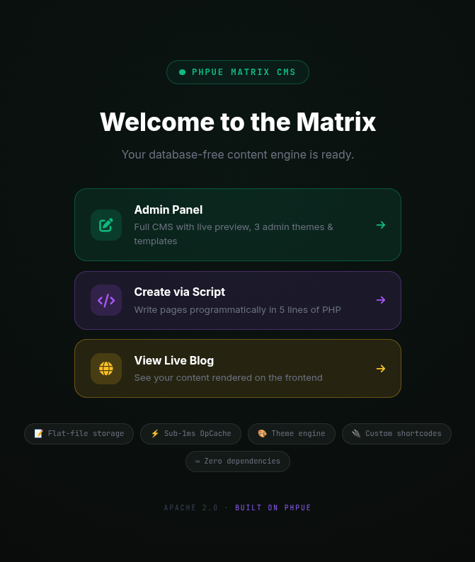
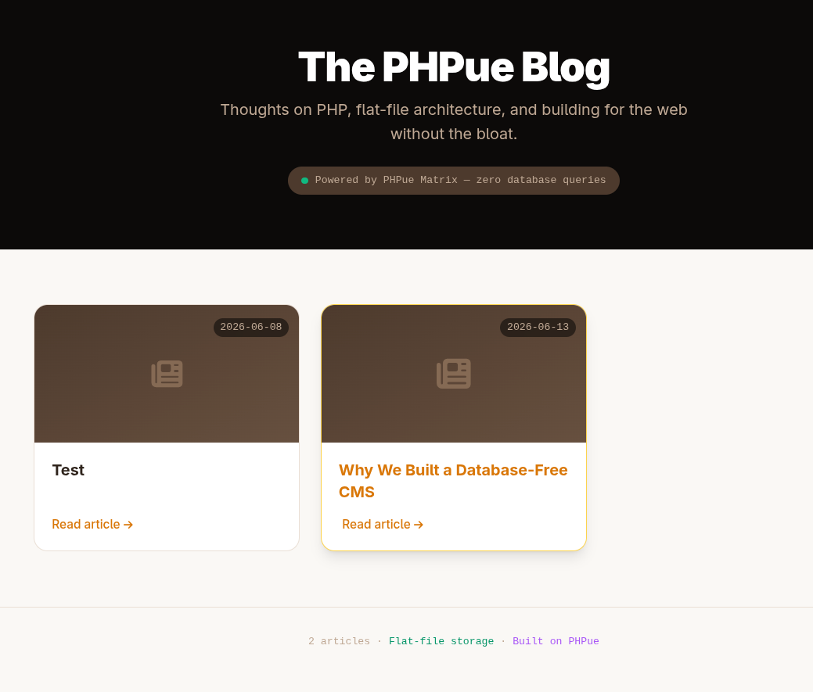
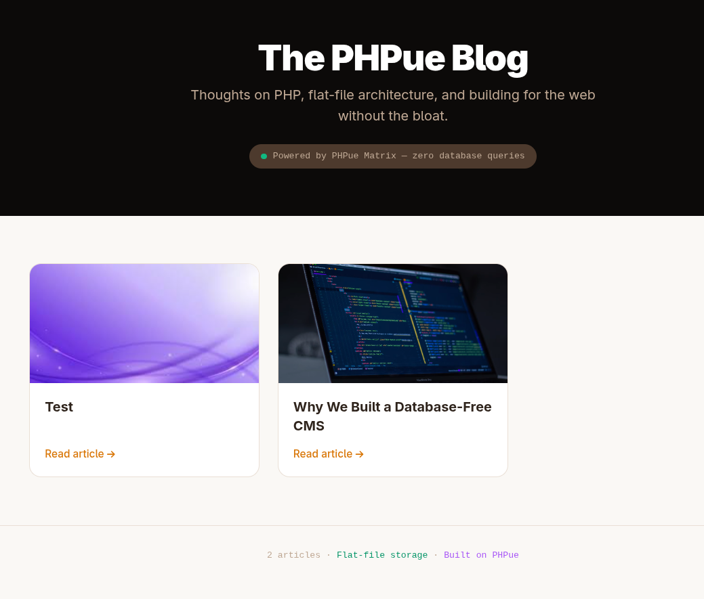
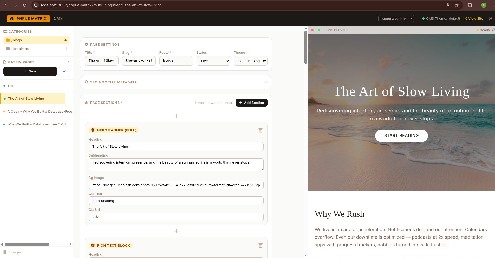
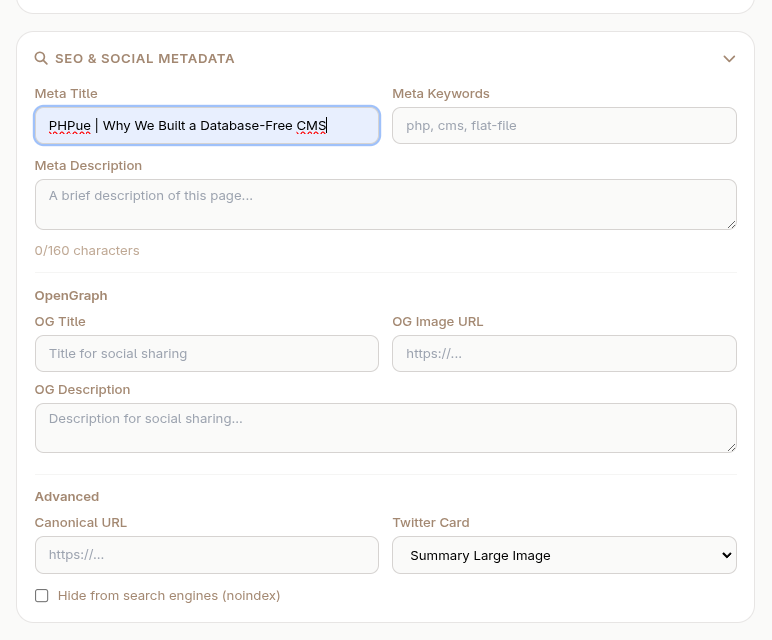
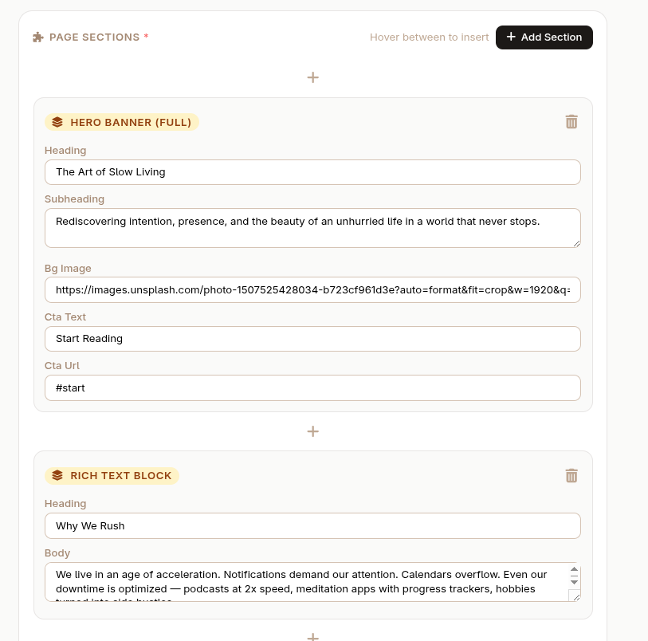
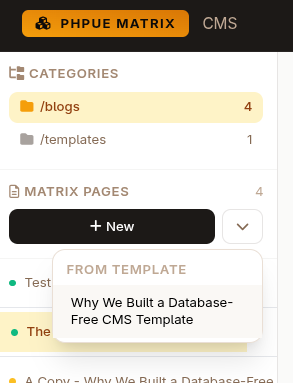

# PHPue Matrix — Database-Free CMS

PHPue Matrix is a flat-file CMS extension for the PHPue framework. It stores content as PHP arrays, renders pages through theme closures, and requires zero database queries. Sub-millisecond page loads via OpCache, no build step, no migrations.



---

## What It Does

PHPue Matrix handles **content rendering** — the body of your pages. SEO metadata is managed separately via `App.pvue`.

| Responsibility | Handled By |
|---------------|-------------|
| Content storage | `createPage()` → `.php` files on disk |
| Content rendering | `getPage()` → theme closures → HTML body |
| Theme management | `getTheme()` → section definitions for admin UI |
| Page listing | `listPages()` → scans route folders |
| Route listing | `listRoutes()` → scans all category folders |
| Page deletion | `deletePage()` → removes `.php` file |
| Shortcode parsing | `parseShortcodes()` → `[[token]]` and `[[namespace.key]]` |
| SEO metadata | `App.pvue` dynamic header |

---

## Blog Frontend



The blog view handles both single posts and the listing page. With a slug, it calls `getPage()` and outputs rendered HTML. Without one, it calls `listPages()` and displays a grid of live posts.



Featured images are loaded via `getPageFeaturedImage()` with automatic fallback to OG image or hero background. Posts without images get a gradient placeholder card.

---

## CMS Admin Portal



The admin interface provides full content management:

- **Route selector** — switch between content categories (blogs, pages, templates)
- **Page CRUD** — create, edit, duplicate, and delete pages
- **Live preview** — iframe updates on every auto-save
- **Template system** — save pages as reusable templates, create new pages from templates



Built-in SEO panel with meta title, description, keywords, OpenGraph tags, Twitter card type, canonical URL, and noindex control. Auto-saves preserve SEO data between edits.



Dynamic section editor with 15+ section types per theme. Add sections via dropdown or insert-point buttons between existing sections. Theme-aware validation warns when sections don't exist in the selected theme.



Save any page as a reusable template, then create new pages from templates with a single click. Templates live in `pages/templates/` and appear in the sidebar dropdown.

---

## Core API

### `getPage(string $route, string $slug): string`

Loads a page file, reads its theme, loops through sections, calls render closures, parses shortcodes, and returns the full HTML body.

```php
$html = \PHPueExt\PHPueMatrix::getPage('blogs', 'my-post');
// Returns rendered HTML — drop into any .pvue template
```

### `createPage(string $route, string $slug, string $theme, array $sections, string $title, string $status, array $seo): bool`

Serializes page data with `var_export()` and writes it to disk as a `.php` file.

```php
$sections = [
    ['type' => 'hero', 'data' => ['heading' => 'Welcome', 'bg_image' => '...']],
    ['type' => 'content', 'data' => ['heading' => 'About', 'body' => '...']],
];

\PHPueExt\PHPueMatrix::createPage('blogs', 'hello-world', 'default', $sections, 'Hello World', 'live');
```

### `getTheme(string $name): array`

Returns theme metadata and section field definitions (without closures) — used by the admin UI to build forms.

### `listPages(string $category): array`

Scans a route folder and returns all pages with slug, title, status, and creation date.

### `listRoutes(): array`

Scans the pages directory for all route folders and returns their names and page counts.

### `deletePage(string $route, string $slug): bool`

Removes a page file from disk.

### SEO Methods

```php
getPageSeo($route, $slug)           // Full SEO array
getPageTitle($route, $slug)         // Meta title with fallback
getPageDescription($route, $slug)   // Meta description with auto-extraction
getPageOgImage($route, $slug)       // OG image with hero fallback
getPageTwitterImage($route, $slug)  // Twitter card image
getPageFeaturedImage($route, $slug) // Featured image for listings
getPageKeywords($route, $slug)      // Meta keywords
getPageCanonical($route, $slug)     // Canonical URL
getPageRobots($route, $slug)        // Robots tag
```

---

## Theme Structure

Themes are PHP files that return an array with `meta`, `shortcodes`, and `sections`. Each section has a `label`, `fields` array, and `render` closure.

```php
// themes/default.php
return [
    'meta' => ['name' => 'Editorial Blog Theme', 'version' => '2.0'],
    'shortcodes' => [
        'phpueLang' => fn($key) => \PHPueExt\PHPueMatrix::$phpueLang[$key] ?? "[[phpueLang.{$key}]]",
        'year' => fn() => date('Y'),
    ],
    'sections' => [
        'hero' => [
            'label' => 'Hero Banner',
            'fields' => ['heading', 'subheading', 'bg_image'],
            'render' => function(array $data): string {
                // Return Tailwind-styled HTML
            },
        ],
    ],
];
```

Two production themes are included: `default` (15 section types) and `patchdesigns` (11 section types with Welsh-inspired palette).

---

## Shortcodes

Content can include `[[token]]` patterns that are resolved at render time. Dot notation enables wildcard namespaces.

```php
// In theme shortcodes:
'phpueLang' => fn($key) => $GLOBALS['phpueLang'][$key] ?? "[[phpueLang.{$key}]]"

// In page content:
"Welcome to [[phpueLang.site_name]] — est. [[year]]"
```

The shortcode parser runs as the final step in `getPage()`, so it works across all section types.

---

## OpCache Strategy

Every method that reads or writes files includes `opcache_invalidate()` calls:

| Method | Invalidates |
|--------|-------------|
| `getPage()` | Page file + Theme file before reading |
| `createPage()` | Written file after saving |
| `getTheme()` | Theme file before reading |
| `listPages()` | Each page file before including |
| `deletePage()` | File before unlinking |

This ensures fresh data on every request while maintaining sub-1ms OpCache performance on the frontend.

---

## Separation of Concerns

PHPue Matrix outputs **body HTML only**. It does not:

- Output `<head>` metadata
- Manage `<title>` tags
- Set OpenGraph or Twitter Card tags
- Handle canonical URLs

Those are handled by `App.pvue` which provides route-aware dynamic SEO with hardcoded fallbacks for listing pages.

```html
// In your .pvue view:
<script>
    $page = \PHPueExt\PHPueMatrix::getPage('blogs', $_GET['slug'] ?? '');
    // SEO is handled separately by your App.pvue
</script>

<template>
    <?= $page ?>  <!-- Just the body content -->
</template>
```
